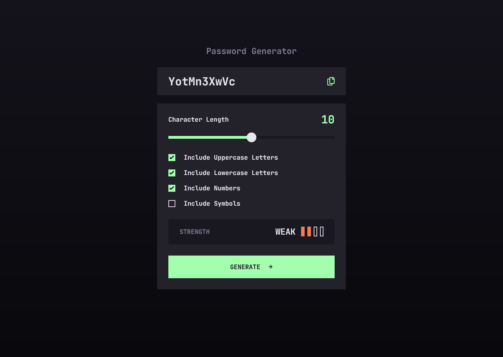

# Frontend Mentor - Password generator app solution

This is a solution to the [Password generator app challenge on Frontend Mentor](https://www.frontendmentor.io/challenges/password-generator-app-Mr8CLycqjh). Frontend Mentor challenges help you improve your coding skills by building realistic projects. 

## Table of contents

- [Overview](#overview)
  - [The challenge](#the-challenge)
  - [Screenshot](#screenshot)
  - [Links](#links)
- [My process](#my-process)
  - [Built with](#built-with)
  - [What I learned](#what-i-learned)
  - [Useful resources](#useful-resources)
- [Author](#author)

## Overview

### The challenge

Users should be able to:

- Generate a password based on the selected inclusion options
- Copy the generated password to the computer's clipboard
- See a strength rating for their generated password
- View the optimal layout for the interface depending on their device's screen size
- See hover and focus states for all interactive elements on the page

### Screenshot

### Links

- [Solution URL](https://github.com/loki-pepe/password-generator-app)
- [Live Site URL](https://loki-pepe.github.io/password-generator-app/)

## My process

### Built with

- Semantic HTML5 markup
- CSS custom properties
- Flexbox
- CSS Grid
- Mobile-first workflow

### What I learned

I learned how to customize checkbox inputs using pure CSS and range inputs using minimal JS (I had to style the progress track color with JS, but the rest was pure CSS).

### Useful resources

- [MDN Web Docs](https://developer.mozilla.org/) - An extensive resource on everything HTML and CSS.
- [Stack Overflow](https://stackoverflow.com/) - Community answers to specific questions.
- [Font-size Clamp Generator](https://clamp.font-size.app/) - A helpful calculator for using the CSS clamp() function.

## Author

- GitHub - [Lovro Peraić](https://github.com/loki-pepe)
- Frontend Mentor - [@loki-pepe](https://www.frontendmentor.io/profile/loki-pepe)
